# Ubuntu Server Home Lab

A practical home lab built to develop Linux administration, networking and troubleshooting skills using **Ubuntu Server**, a **Windows 10 client VM** and **VirtualBox**.

The lab covers SSH administration, Linux users and permissions, Apache2, DHCP, DNS with BIND9, VirtualBox networking and practical troubleshooting.

---

## Lab overview

| Component | Configuration |
|---|---|
| Server | Ubuntu Server 26.04 LTS |
| Client | Windows 10 VM |
| Hypervisor | VirtualBox |
| Internal network | `10.0.0.0/24` |
| Ubuntu internal IP | `10.0.0.1` |
| DHCP pool | `10.0.0.101 - 10.0.0.200` |
| DHCP-advertised gateway | `10.0.0.1` |
| Internal DNS server | `10.0.0.1` |
| DNS zone | `ubuntu.lab` |
| Test A record | `server.ubuntu.lab -> 10.0.0.1` |

## Network layout

The Ubuntu VM used separate VirtualBox networking paths for different parts of the lab:

```text
Windows host
    |
    | VirtualBox NAT + port forwarding
    | SSH / HTTP
    v
Ubuntu Server
    |
    | Internal Network: 10.0.0.0/24
    | DHCP / DNS
    v
Windows 10 client VM
```

This allowed SSH and Apache2 to be tested from the host while DHCP and DNS were tested on an isolated client network.

---

## SSH administration

SSH was used to remotely administer the Ubuntu Server from Windows.

During testing, the SSH client reported:

```text
REMOTE HOST IDENTIFICATION HAS CHANGED!
```

The VM had been recreated, so the host key stored in the Windows `known_hosts` file no longer matched the server.

After verifying that the change was expected, the stale key was removed:

```bash
ssh-keygen -R 127.0.0.1
```

The connection was then established again and the new server fingerprint was accepted.

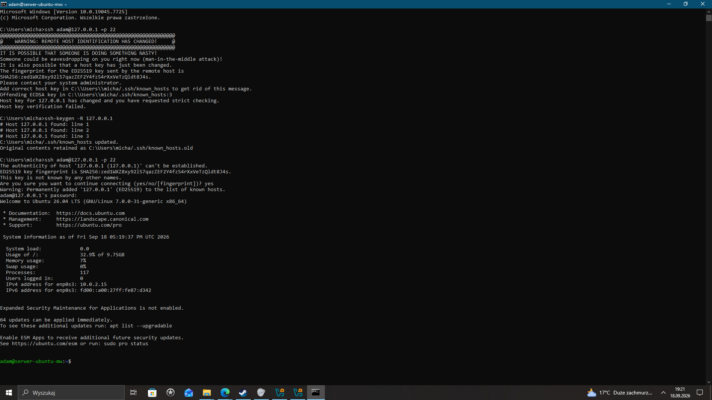

---

## Users, groups and permissions

Multiple users and a Linux group were created to practice group-based access control.

The group `newgroup1234` contained authorized users including `adam` and `testuser`.

A shared directory was created and assigned to the group:

```bash
sudo mkdir -p /srv/newgroupfolder
sudo chown :newgroup1234 /srv/newgroupfolder
sudo chmod 2770 /srv/newgroupfolder
```

The `2` in `2770` enables **setgid**, causing new files created inside the directory to inherit the directory group.

An authorized user was able to create files in the directory, while a user outside the group received `Permission denied`.

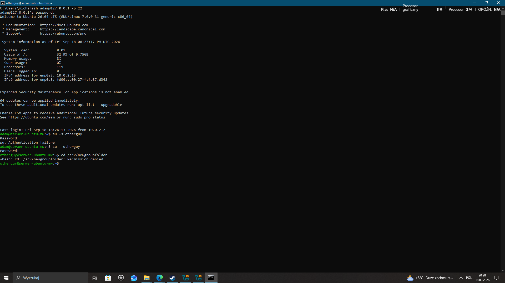

### Group membership troubleshooting

After adding `adam` to the group, the already-open SSH session still used the old supplementary group list.

Reconnecting refreshed the session and the new group membership became effective.

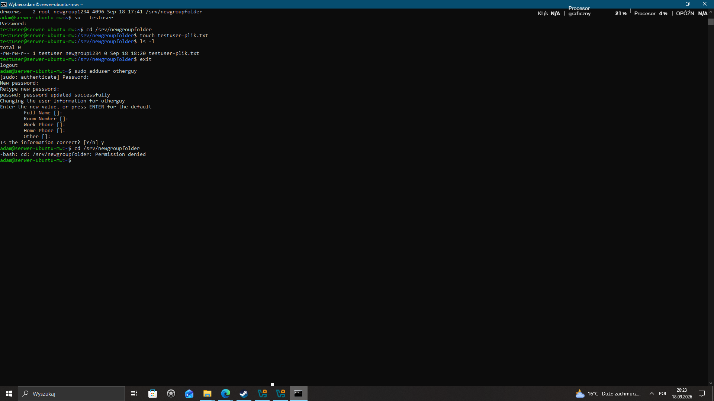

---

## Apache2 web server

Apache2 was installed and managed as a `systemd` service.

Service status was verified with:

```bash
sudo systemctl status apache2
```

Because the Ubuntu VM was accessed through VirtualBox NAT, HTTP port forwarding was configured:

```text
Windows host 127.0.0.1:8080
             |
             v
Ubuntu VM port 80
```

The default Apache2 page was successfully opened from the Windows host.

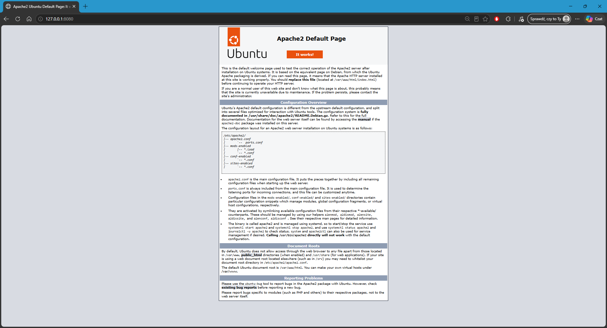

The default page was then replaced with a custom test page stored under `/var/www/html/`.

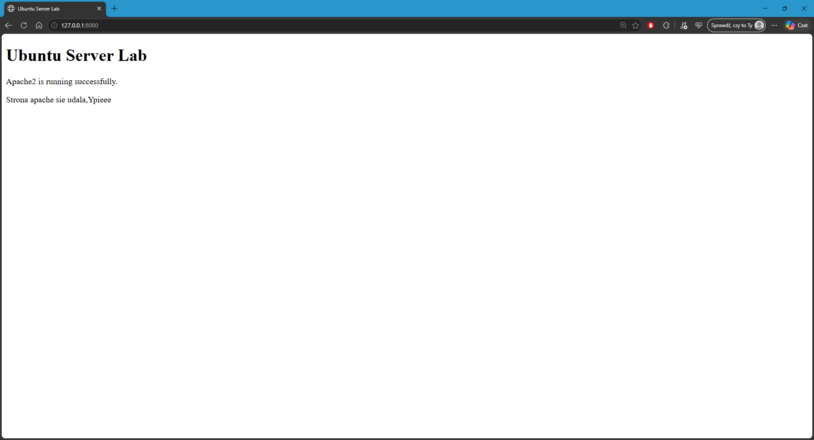

---

## DHCP server

ISC DHCP Server was configured on the Ubuntu internal-network interface.

The configured address pool was:

```text
10.0.0.101 - 10.0.0.200
```

for the `10.0.0.0/24` network. DHCP also advertised `10.0.0.1` as the default gateway.

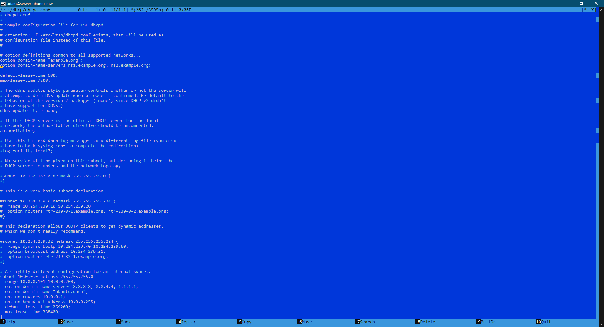

The server logs showed the standard DHCP **DORA** exchange:

```text
DHCPDISCOVER
DHCPOFFER
DHCPREQUEST
DHCPACK
```

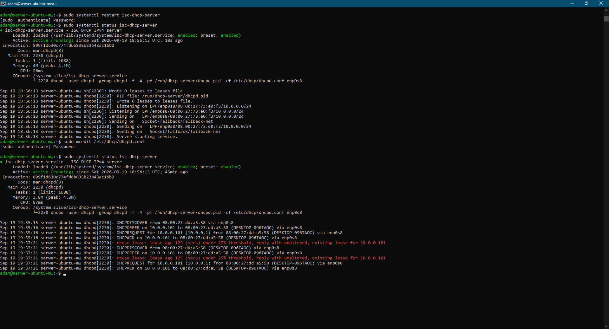

The Windows client successfully obtained its IPv4 configuration from the Ubuntu DHCP server.

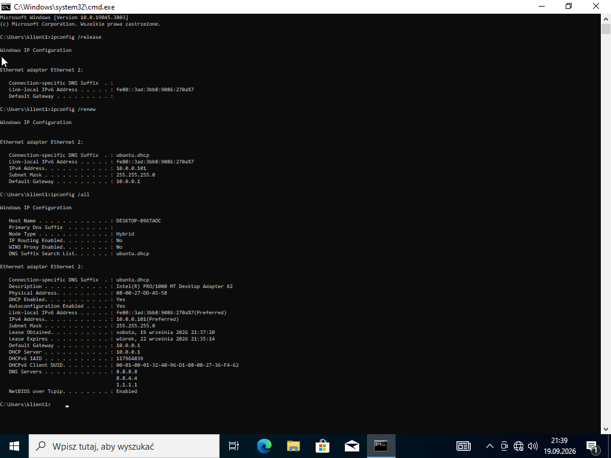

---

## DNS server with BIND9

BIND9 was configured as the DNS server for the internal network.

A forward lookup zone was created:

```text
ubuntu.lab
```

with an A record:

```text
server.ubuntu.lab -> 10.0.0.1
```

The zone file was validated with:

```bash
sudo named-checkzone ubuntu.lab /etc/bind/db.ubuntu.lab
```

### Local DNS test

Resolution was first tested directly on Ubuntu:

```bash
dig @127.0.0.1 server.ubuntu.lab
```

The query returned `10.0.0.1`.

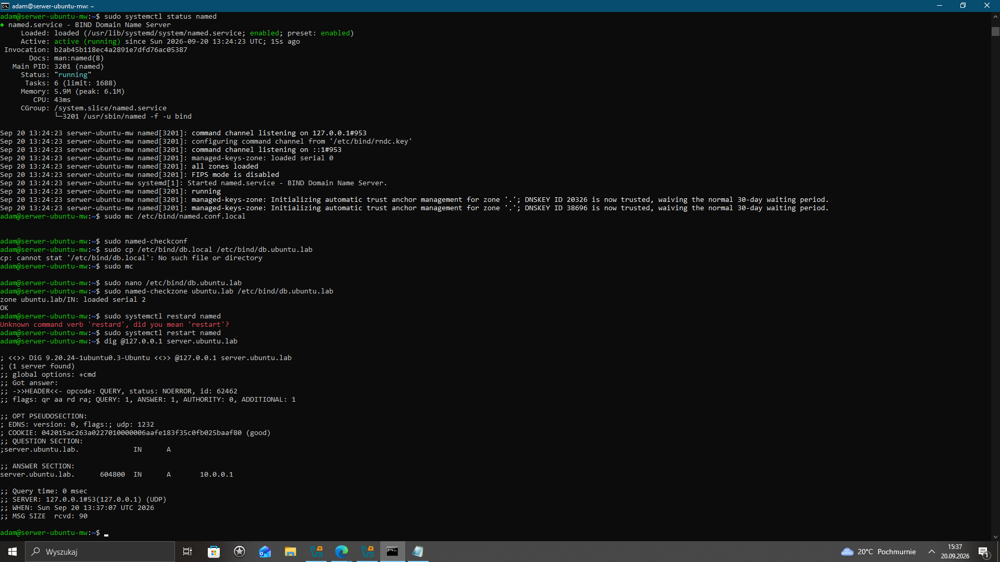

### Windows client test

The Windows client then queried the Ubuntu DNS server directly:

```cmd
nslookup server.ubuntu.lab 10.0.0.1
```

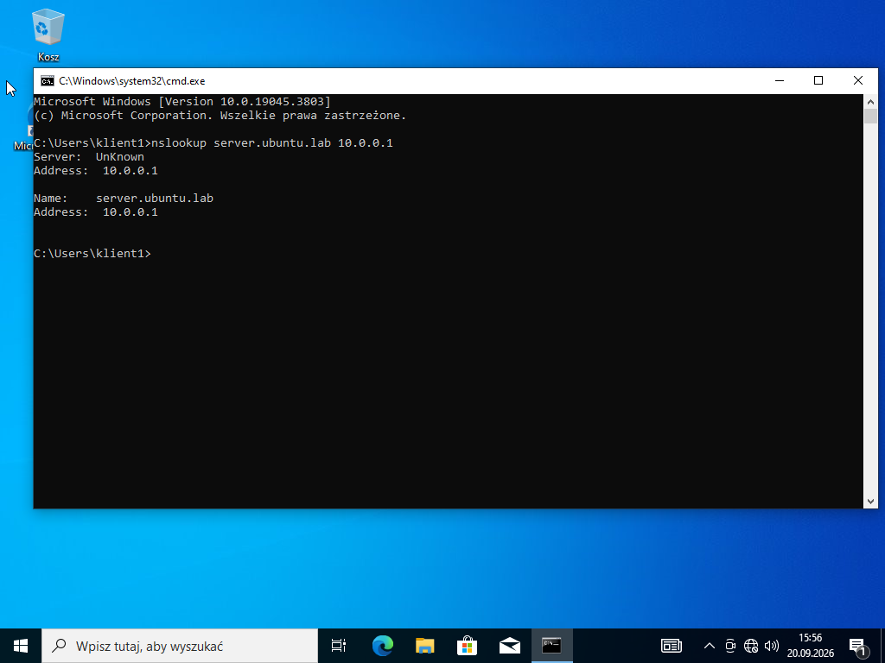

Finally, DHCP was configured to advertise `10.0.0.1` as the DNS server. After renewing the DHCP lease, Windows could resolve the hostname without manually specifying a DNS server:

```cmd
nslookup server.ubuntu.lab
```

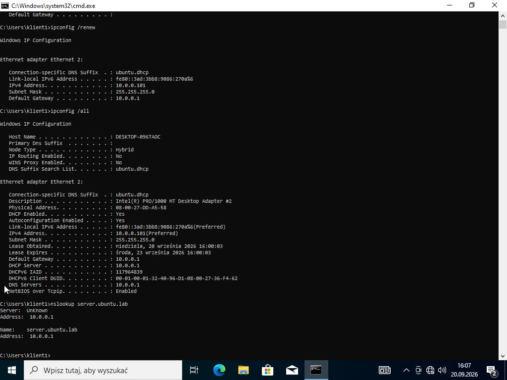

This verified the complete flow:

```text
Ubuntu DHCP
    |
    | provides IP configuration + DNS server 10.0.0.1
    v
Windows client
    |
    | DNS query
    v
BIND9 on Ubuntu
    |
    v
server.ubuntu.lab -> 10.0.0.1
```

---

## Troubleshooting performed

During the lab I encountered and resolved several practical issues:

- stale SSH host key after recreating the virtual machine
- supplementary Linux group membership not updating in an existing SSH session
- DHCP communication between Ubuntu and a Windows client on an isolated VirtualBox network
- DNS resolution from both the server and client side
- BIND9 configuration differences between Ubuntu versions
- VirtualBox NAT port forwarding for SSH and HTTP access

---

## What I practiced

- Ubuntu Server administration
- SSH remote access
- Linux users, groups and file permissions
- `systemd` and `systemctl`
- Apache2 basics
- DHCP configuration and the DORA process
- BIND9 forward lookup zones and A records
- DHCP and DNS integration
- VirtualBox NAT and Internal Network modes
- port forwarding
- Linux/Windows troubleshooting

---

## Planned improvement

Add a reverse DNS zone and PTR record so that `10.0.0.1` resolves back to `server.ubuntu.lab`.
